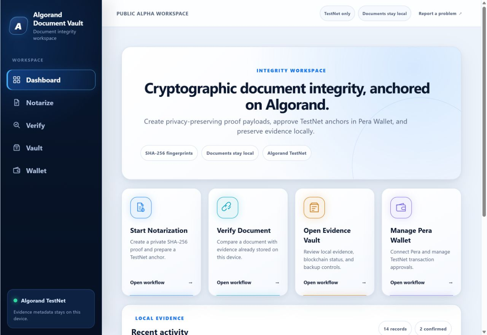
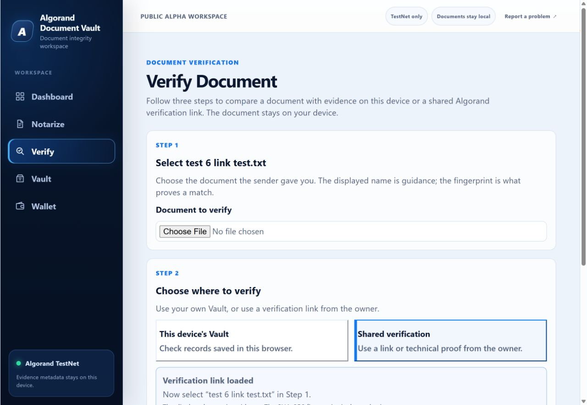
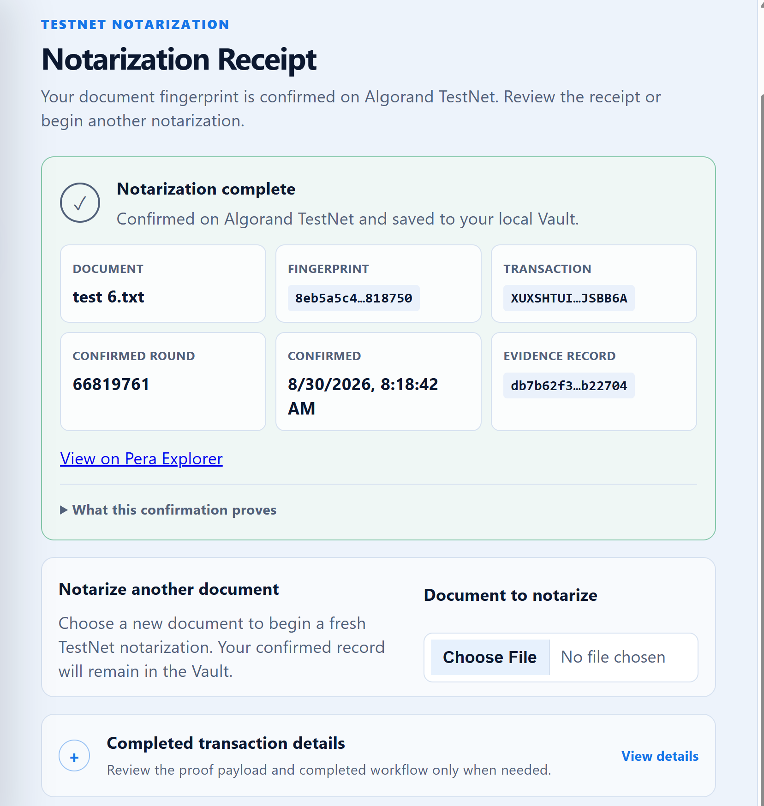

<p align="center">
  
</p>

# Algorand Document Vault

**Privacy-first document integrity, anchored on Algorand.**

[](https://github.com/tkent2002-glitch/algorand-document-vault/actions/workflows/ci.yml)
[](https://github.com/tkent2002-glitch/algorand-document-vault/releases/tag/v0.1.0-alpha)
[](LICENSE)
[](https://www.typescriptlang.org/)
[](https://react.dev/)
[](https://algorand.co/)

> **Public alpha · Algorand TestNet only · Unaudited**

**[Open the public alpha](https://algorand-document-vault.pages.dev/)** ·
**[View the release](https://github.com/tkent2002-glitch/algorand-document-vault/releases/tag/v0.1.0-alpha)** ·
**[Report feedback](https://github.com/tkent2002-glitch/algorand-document-vault/issues/new/choose)** ·
**[Read the security policy](SECURITY.md)**

Algorand Document Vault creates cryptographic evidence that a document existed
at a particular moment without uploading or storing the document itself. It
calculates a SHA-256 fingerprint locally, anchors a canonical proof on Algorand
TestNet, and preserves the resulting evidence in the browser's local Vault.

The original document never leaves the user's device. A verification link
contains proof metadata and a document-name hint, never the document itself.

## Try the public alpha

1. **Notarize:** select a document, connect Pera Wallet, review the zero-amount
   TestNet transaction, and approve it.
2. **Verify:** compare a document with this browser's Vault or open a verification
   link supplied by the document owner.
3. **Share:** create a reusable verification link from confirmed Vault evidence
   and send it together with the original document through a channel you trust.

Use only disposable TestNet accounts and non-sensitive sample documents while
the project is in public alpha.

## Product tour

<table>
  <tr>
    <td width="50%" valign="top">
      
      <br /><strong>Task-first workspace</strong><br />Start notarization, verification, Vault, or wallet workflows from one dashboard.
    </td>
    <td width="50%" valign="top">
      
      <br /><strong>Guided shared verification</strong><br />A loaded link identifies the expected document while the SHA-256 fingerprint remains authoritative.
    </td>
  </tr>
  <tr>
    <td colspan="2" align="center">
      
      <br /><strong>Confirmed TestNet receipt</strong><br />Review the fingerprint, transaction, round, and locally stored evidence record.
    </td>
  </tr>
</table>

## What is available now

- Local SHA-256 hashing without document uploads
- Pera-approved zero-amount self-payment proofs on Algorand TestNet
- Durable IndexedDB evidence history with corruption and migration safeguards
- Plain JSON and PBKDF2/AES-GCM encrypted Vault backups
- Local verification and self-contained shared verification links
- Independent TestNet receipt, canonical note, and transaction-policy checks
- User-approved document/proof folders on supported desktop browsers, with a
  system-share fallback elsewhere

**Current focus:** the feature set is frozen for independent security review,
cross-browser and manual assistive-technology review, and release validation.
MainNet use is not supported, and the application remains unaudited.

## Security and privacy boundaries

- Documents are hashed locally and are not uploaded or stored by the application.
- Shareable proof links omit document bytes, wallet addresses, local record IDs,
  and complete evidence history.
- Pera Wallet remains the private-key boundary; the application never receives
  or stores wallet private keys.
- The application currently accepts only its documented Algorand TestNet proof
  transaction policy.
- Local Vault confidentiality depends on the user's device, browser profile, and
  extension environment.
- Blockchain evidence proves timestamped existence and integrity, not authorship,
  identity, truthfulness, consent, or legal enforceability.
- The project has prepared an [independent security review package](docs/security-review/README.md),
  but no independent audit has been completed.

Do not disclose suspected vulnerabilities in a public issue. Follow the private
reporting process in [SECURITY.md](SECURITY.md).

## How it works

1. The browser reads the selected document locally and calculates its SHA-256
   fingerprint.
2. The application creates a versioned proof payload and local evidence record.
3. It constructs a zero-amount Algorand TestNet self-payment whose note contains
   the canonical proof.
4. The user reviews and signs the transaction through Pera Wallet.
5. The application submits the signed transaction and waits for confirmation.
6. The transaction ID, round, timestamps, and fingerprint are saved in IndexedDB.
7. Verification recomputes the selected document's fingerprint locally.
8. Shared verification also retrieves the TestNet receipt and independently
   checks the transaction ID, round, note, network, fee, amount, receiver, and
   absence of close/rekey/group/lease side effects.

## Architecture

```text
React UI
   |
Application workflows
   |
EvidenceRepository (async boundary)
   |---------------------------|
IndexedDB evidence store       Algorand / wallet services
   |                           |
Backup, migration, trust       Pera Wallet + Algod TestNet
```

The code separates presentation, workflows, repositories, storage,
cryptographic services, wallet integration, and Algorand network operations.

Documentation:

- [Software architecture](docs/SOFTWARE_ARCHITECTURE.md)
- [Storage architecture](docs/architecture/STORAGE_ARCHITECTURE.md)
- [Security architecture](docs/architecture/SECURITY_ARCHITECTURE.md)
- [Blockchain architecture](docs/architecture/BLOCKCHAIN_ARCHITECTURE.md)
- [Independent security review package](docs/security-review/README.md)
- [Development guide](docs/developer/DEVELOPMENT.md)
- [Testing guide](docs/developer/TESTING.md)
- [Roadmap](docs/roadmap/ROADMAP.md)
- [Changelog](CHANGELOG.md)

## Technology

React 19 · TypeScript 6 · Vite 8 · Vitest · Playwright · Algorand JavaScript
SDK · Pera Wallet Connect · IndexedDB · Web Crypto API · GitHub Actions

## Local development

Requirements: Node.js 24, npm 11 or later, and a modern browser with IndexedDB
and Web Crypto support.

```powershell
git clone https://github.com/tkent2002-glitch/algorand-document-vault.git
cd algorand-document-vault
npm ci
npm run dev
```

Run the primary quality gates:

```powershell
npm test
npm run lint
npm run build
npm run security:production
```

## Project status and next gates

The public `v0.1.0-alpha` release is available for TestNet evaluation. Work now
centers on:

- alpha feedback and usability findings;
- independent security review;
- broader browser, mobile-device, and assistive-technology validation;
- larger-Vault performance testing; and
- a separate MainNet readiness decision.

See the [roadmap](docs/roadmap/ROADMAP.md) and
[release validation record](docs/release/RC1_VALIDATION.md) for detailed status.

## Contributing

Contributions and alpha feedback are welcome. Review
[CONTRIBUTING.md](CONTRIBUTING.md), the
[Code of Conduct](CODE_OF_CONDUCT.md), and the available
[issue forms](https://github.com/tkent2002-glitch/algorand-document-vault/issues/new/choose).

## License

Licensed under the [MIT License](LICENSE).
