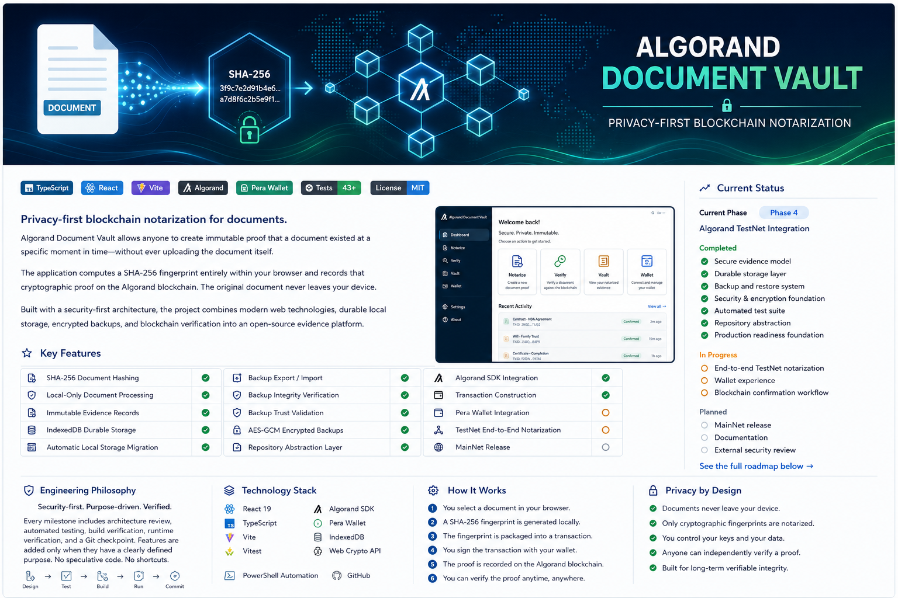

<p align="center">
  
</p>

# Algorand Document Vault

**Privacy-first blockchain notarization for documents.**

[](https://github.com/tkent2002-glitch/algorand-document-vault/actions/workflows/ci.yml)
[](LICENSE)
[](https://www.typescriptlang.org/)
[](https://react.dev/)
[](https://algorand.co/)

Algorand Document Vault creates cryptographic proof that a document existed at a particular moment without uploading or storing the document itself. The application computes a SHA-256 fingerprint locally in the browser, prepares that fingerprint for notarization on Algorand, and preserves the resulting evidence record in durable local storage.

> The original document never leaves the user's device. Only its cryptographic fingerprint is prepared for blockchain notarization.

## Why this project exists

Traditional document-verification systems often require users to hand sensitive files to a third party. Algorand Document Vault uses a different trust model:

- Documents remain under the user's control.
- SHA-256 hashing occurs locally in the browser.
- Only the fingerprint and proof metadata are placed into the notarization workflow.
- Algorand provides an independently verifiable timestamp and transaction record.
- Anyone with the original document can recompute its hash and compare it with the preserved evidence.

The system proves document existence and integrity at a point in time. It does not determine whether a document's claims are truthful, lawful, or enforceable.

## Current status

**Current phase:** Phase 4 — Algorand TestNet integration and hardening

| Capability | Status |
|---|:---:|
| Local SHA-256 document hashing | Complete |
| Evidence record model and repository | Complete |
| IndexedDB durable storage | Complete |
| Legacy localStorage migration and recovery | Complete |
| Plain backup export and import | Complete |
| Backup integrity and trust verification | Complete |
| AES-GCM encrypted backups and recovery | Complete |
| Algorand SDK transaction construction | Implemented |
| Pera Wallet connection and signing | Implemented |
| TestNet submission and confirmation flow | Validation in progress |
| MainNet release | Planned |

## Key features

### Privacy by design

- Local-only document processing
- No document uploads
- Hash-only proof model
- User-controlled evidence storage

### Evidence repository

- Asynchronous repository architecture
- IndexedDB persistence
- Duplicate fingerprint detection
- Evidence history grouped by document fingerprint
- Automatic migration from the legacy browser store

### Backup and recovery

- Human-readable JSON backups
- SHA-256 integrity metadata
- Structured trust evaluation
- Safe import preview
- Duplicate and record-ID conflict detection
- Optional PBKDF2 + AES-GCM encrypted backups

### Algorand integration

- TestNet node configuration
- Proof-note serialization
- Zero-amount self-payment transaction construction
- Pera Wallet signing
- Signed transaction submission
- Confirmation monitoring
- Pera Explorer transaction links

## How it works

1. Select a document in the browser.
2. The application calculates a SHA-256 fingerprint locally.
3. A structured evidence record and proof payload are created.
4. A zero-amount Algorand transaction is prepared with the proof in its note field.
5. The user reviews and signs the transaction through Pera Wallet.
6. The signed transaction is submitted to Algorand TestNet and monitored for confirmation.
7. The transaction ID, timestamps, and confirmation round are stored in the local Evidence Vault.
8. The original document can later be verified by recomputing its fingerprint.

## Architecture

```text
React UI
   |
Application workflows
   |
EvidenceRepository (async boundary)
   |---------------------------|
IndexedDB evidence store       Algorand / wallet services
   |                           |
Backup, migration, trust       Pera Wallet + Algod TestNet
```

The project separates presentation, workflows, repositories, storage implementations, cryptographic services, wallet integration, and Algorand network operations.

Detailed documentation:

- [Software architecture](docs/SOFTWARE_ARCHITECTURE.md)
- [Storage architecture](docs/architecture/STORAGE_ARCHITECTURE.md)
- [Security architecture](docs/architecture/SECURITY_ARCHITECTURE.md)
- [Blockchain architecture](docs/architecture/BLOCKCHAIN_ARCHITECTURE.md)
- [Roadmap](docs/roadmap/ROADMAP.md)

## Engineering philosophy

Algorand Document Vault is developed as a security-first project.

Every milestone is expected to include:

1. A clearly defined purpose and trust boundary
2. A controlled implementation step
3. Automated test verification
4. Production build verification
5. Runtime verification when behavior changes
6. A Git checkpoint after successful validation

The project avoids speculative features and "just in case" abstractions. Every service, class, and folder should have a clear responsibility.

## Technology stack

- React 19
- TypeScript 6
- Vite 8
- Vitest
- Algorand JavaScript SDK
- Pera Wallet Connect
- IndexedDB
- Web Crypto API
- PowerShell automation
- GitHub Actions

## Local development

### Requirements

- Node.js 24
- npm 11 or later
- A modern browser with IndexedDB and Web Crypto support

### Setup

```powershell
cd C:\Projects\algorand-document-vault
npm ci
npm run dev
```

### Verification

```powershell
npm test
npm run build
```

See [Development Guide](docs/developer/DEVELOPMENT.md) and [Testing Guide](docs/developer/TESTING.md).

## Security

Please do not disclose vulnerabilities through a public issue. Follow the private reporting process in [SECURITY.md](SECURITY.md).

Important boundaries:

- The application currently targets Algorand TestNet.
- The project has not yet completed an independent security audit.
- Encrypted backups cannot be recovered if the password is lost.
- Blockchain notarization proves timestamped existence and integrity, not legal validity or truthfulness.

## Roadmap

### Completed

- Core evidence model and SHA-256 hashing
- Repository and service boundaries
- Durable IndexedDB persistence
- Backup trust and encryption architecture
- Automated service, repository, storage, and recovery tests
- Algorand transaction, wallet, submission, and confirmation foundations

### In progress

- Full TestNet end-to-end validation
- Wallet and network failure classification
- Submission retry and timeout behavior
- Blockchain verification hardening
- Public alpha release preparation

### Planned

- Independent security review
- Accessibility and cross-browser review
- Performance testing with larger evidence vaults
- MainNet readiness review
- Versioned public releases

## Contributing

Contributions are welcome after reviewing [CONTRIBUTING.md](CONTRIBUTING.md) and the [Code of Conduct](CODE_OF_CONDUCT.md).

## License

Licensed under the [MIT License](LICENSE).